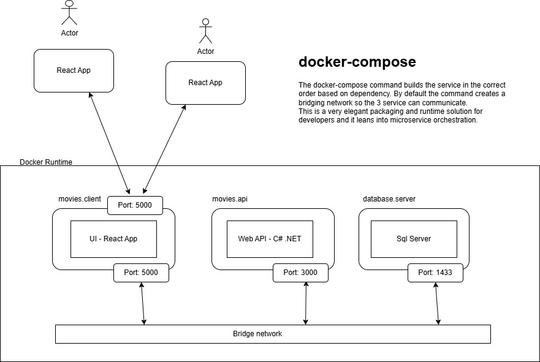

## React - ASP.NET - Sql Sever - Docker Compose

https://www.youtube.com/watch?v=XTqwvQAv9Lg&t=40s

## Overview
The functionality of this application is limited to a single entity - Movie. However, what this sample app is focused on is highlighting the deployment capabilities of Docker
and docker compose. The full solution when running provions 3 docker containers:
- 1. the front end Blazor App browser client
- 2. the back end C# web api endpoints  
- 3. an instance of MS Sql Server

In Docker desktop you can see this represented - docker compose groups the 3 containes together and enables communication between them.

The names of the container instances correspond with the definitions in the docker-compose.yaml file.

## Docker Compose

This solution demonstrates the use of docker compose to bring up 3 containers representing the key components of the application as docker containes.

- UI - this is implemented as a React App - see the Client folder in the Movies.Presentation project.

- Web API - this implements operations for creating, updating and deleting Movices. This is implemented in the Movies.Presentation and the Application, Domain and Infrastructure projects.

- Sql Server - an instance of the database server is made available in a docker container

To run the full solution use a command prompt and navigate to the root folder of the solution - the one that containes the docker-compose.yml file.

### Clean Architecture (popularized by Robert C. Martin) emphasizes:

### Separation of concerns

Independence from frameworks, UI, and databases

Testability

Business rules as the core

### Key Layers in Clean Architecture:

Domain Layer (Core business logic)

Application Layer (Use cases/application logic)

Infrastructure Layer (External concerns: DB, APIs, etc.)

Presentation Layer (UI/API)

Uses:
Mediator

CQRS 

Domain

Infrastucture

Testing

React App

Web API

Sql Server

Docker

Docker Compose
