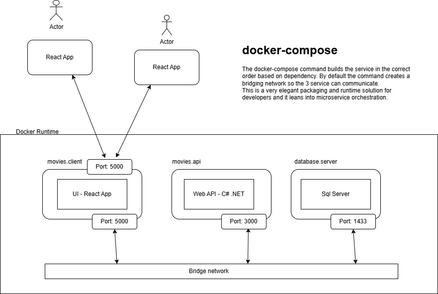
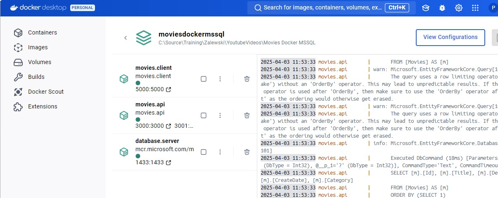

## React - ASP.NET - Sql Sever - Docker Compose

https://www.youtube.com/watch?v=XTqwvQAv9Lg&t=40s

## Overview
The functionality of this application is limited to a single entity - Movie. However, what this sample app is focused on is highlighting the deployment capabilities of Docker
and docker compose. The full solution when running provions 3 docker containers:
 1. The front end React App browser client
 2. The back end C# web api endpoints  
 3. An instance of MS Sql Server

The docker runtime and commands handle building and then hosting the container instances and wiring up the communication between them with a bridging network.

The React App and Web Api each have there own Docker file that the docker-compose file references to build the apps, package images and thne run them each of them in their
own container. The Sql Server instance uses an image from the Github repo.

When the full application is running you can each of the containers in Docker desktop - docker compose groups the 3 containes together and enables communication between them.

The names of the container instances correspond with the definitions in the docker-compose.yaml file.

## Docker Compose

This solution demonstrates the use of docker compose to bring up 3 containers representing the key components of the application as docker containes.

- UI - this is implemented as a React App - see the Client folder in the Movies.Presentation project.

- Web API - this implements operations for creating, updating and deleting Movices. This is implemented in the Movies.Presentation and the Application, Domain and Infrastructure projects.

- Sql Server - an instance of the database server is made available in a docker container

To run the full solution use a command prompt and navigate to the root folder of the solution - the one that containes the docker-compose.yml file.

